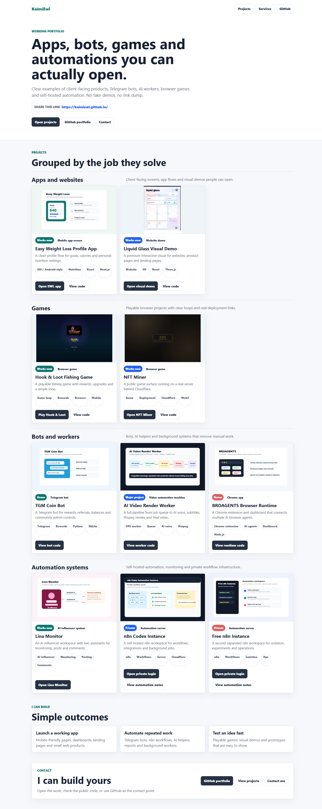
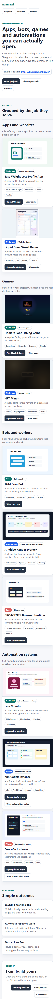

# KaimiEwl.github.io

[](https://github.com/KaimiEwl/KaimiEwl.github.io/actions/workflows/pages.yml)

Public portfolio website for apps, games, bots, AI automation and video pipeline work.

Live site: https://kaimiewl.github.io/





## What It Shows

- Working public links for live apps and demos
- Short client-readable project summaries
- Clean project groups instead of a technical link dump
- GitHub links for code review where the project can be public
- Private automation systems described without exposing secrets

## Project Groups

- Apps and websites
- Games
- Bots and automation
- Automation infrastructure

## Local Preview

```bash
npx vite --host 127.0.0.1
```

## Status

Published with GitHub Pages from this repository.
